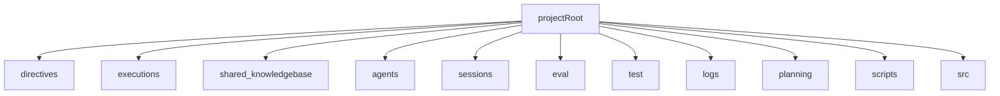

# Scaffold deployment kit (hybrid OS)

## Inputs we will treat as authoritative

- `[raw-output/FRAMEWORK.md](/Volumes/uss/cloudworkspace/0_operator/1_Inbox/taskholder/th_agent-EXPERT-framework/raw-output/FRAMEWORK.md)`: system architecture (directives/executions/shared-knowledgebase/planning/sessions/logs/test/eval).
- `[raw-output/FRAMEWORK-CHECKLIST.md](/Volumes/uss/cloudworkspace/0_operator/1_Inbox/taskholder/th_agent-EXPERT-framework/raw-output/FRAMEWORK-CHECKLIST.md)`: verification checks we’ll translate into a machine-runnable validator.
- `[raw-chat-distilled-to-handoff-draft/agentic_contract.txt](/Volumes/uss/cloudworkspace/0_operator/1_Inbox/taskholder/th_agent-EXPERT-framework/raw-chat-distilled-to-handoff-draft/agentic_contract.txt)`: per-agent container semantics.
- `[raw-chat-distilled-to-handoff-draft/core_directives.txt](/Volumes/uss/cloudworkspace/0_operator/1_Inbox/taskholder/th_agent-EXPERT-framework/raw-chat-distilled-to-handoff-draft/core_directives.txt)`: SOP-style directives content (KB_GUARDRAILS, HANDOFF_PROTOCOL, PROGRESSIVE_LOADING, FAILURE_HANDLING).
- Draft artifacts to be reorganized: `[__ref/expert-framework-reverse-engineered-drafts/tmp/reverse-engineer-expert-framework/](/Volumes/uss/cloudworkspace/0_operator/1_Inbox/taskholder/th_agent-EXPERT-framework/__ref/expert-framework-reverse-engineered-drafts/tmp/reverse-engineer-expert-framework)`.

## Target topology (confirmed)

- **Hybrid**:
  - Global OS at repo root: `directives/`, `executions/`, `shared-knowledgebase/`, `sessions/`, `eval/`, `test/`, `logs/`, `planning/`, `scripts/`, `src/`, `agents/`.
  - Per-agent containers under `agents/<agentname>/` containing agent-specific instructions + KB manifest + optional overrides that reference global layers.

## What “deployment kit” will do

### 1) Canonical folder tree generation

Create (or verify) the OS structure described in `FRAMEWORK.md` + per-agent structure from `agentic_contract.txt`.

Proposed minimal tree:

### 2) Promote SOP directives into `directives/`

- Split `core_directives.txt` into:
  - `directives/KB_GUARDRAILS.md`
  - `directives/HANDOFF_PROTOCOL.md`
  - `directives/PROGRESSIVE_LOADING.md`
  - `directives/FAILURE_HANDLING.md`

Also generate:
- `directives/README.md` (index + enforcement notes)

### 3) Seed “agent steering” artifacts (templates + examples)

- Generate global:
  - `AGENTS.md` (catalog of the 7 canonical agents + what they can/can’t do, derived from contract + FRAMEWORK).
  - `shared-knowledgebase/manifest.md` (minimal skeleton + links; no invented knowledge).
  - `shared-knowledgebase/frameworks/kb_snippet_format.md` (derived from contract + frontmatter template).

- Generate per-agent containers:
  - `agents/metagpt/`, `agents/researchgpt/`, `agents/analysisgpt/`, `agents/designgpt/`, `agents/implementationgpt/`, `agents/testgpt/`, `agents/evaluationgpt/`
  - Each gets:
    - `<agent>_system-instructions.md` (frontmatter + Purpose/Variables/Instructions/Workflow/Report/Examples). Must reference global `directives/*.md` and the KB-first invariants.
    - `kb_<agent>-manifest.md` (progressive-loading index skeleton; links into global KB).
    - `mcp.json` template (capabilities declared; no assumption on actual MCP tool names).
    - `.env.example` (multi-provider keys placeholders; **no localhost URLs**—use `{{HOST_FQDN}}` placeholders).
    - `test/`, `eval/`, `sessions/` folders seeded with README stubs.

### 4) Seed `executions/` and `src/`

Even in **templates-only** mode, we need deterministic tooling for scaffolding + validation:

- `scripts/scaffold_os.py` (the requested “script of some sort”):
  - `--dry-run` (prints intended filesystem actions)
  - `--apply` (creates folders/files)
  - `--agents metagpt,researchgpt,...` (optional override)
  - `--force` (overwrite only files explicitly marked as generated)

- `scripts/validate_scaffold.py` (machine-runnable verifier):
  - Encodes checks from `FRAMEWORK-CHECKLIST.md` (existence, minimal non-empty sections, required placeholders).

- `src/agentic_os/` (minimal library used by scripts):
  - `paths.py` (canonical paths)
  - `render.py` (template rendering)
  - `checks.py` (validation rules)
  - `templates/` (Jinja2/format-string templates for directives/agents/KB docs)

### 5) Re-home current tmp drafts + mark non-essential

We will **not delete anything**; we will stage:

- **Promote to canonical (kept):**
  - `raw-output/FRAMEWORK.md` → root `FRAMEWORK.md`
  - `raw-output/FRAMEWORK-CHECKLIST.md` → root `FRAMEWORK-CHECKLIST.md`
  - `raw-chat-distilled-to-handoff-draft/agentic_contract.txt` → root `AGENTIC_WORKFLOW_CONTRACT.md` (converted to markdown if needed)

- **Move to `directives/templates/` (reference-only):**
  - `plan.md`, `build.md`, `self-improve.md`, `plan_build_improve.md` from the reverse-engineered drafts (these become prompt templates, not runtime directives).

- **Move to `marked-for-deletion/` (non-essential to runtime OS, retained for provenance):**
  - `GAP_ANALYSIS.md`, `VERIFICATION.md`, `SUMMARY.md`, `CONTEXT_ENGINEERING_UPDATE.md`, `CONTEXT_RESEARCH_PLAN.md`, `INDEX.md`, `DIRECTORY_STRUCTURE.md`, `AGENTS.example.md`, and the long reverse-engineered `README.md`.

### 6) Add agent-hooks scaffolding (placeholders, no invented behavior)

Create a minimal “hooks contract” and stubs:
- `directives/AGENT_HOOKS.md` (what hooks exist, when they run, what they may write)
- `executions/hooks/` with stub README + placeholder Python entrypoints (no runtime assumptions)

## Deliverables after implementation

- One runnable generator script: `scripts/scaffold_os.py`
- One runnable validator script: `scripts/validate_scaffold.py`
- Canonical root docs: `FRAMEWORK.md`, `FRAMEWORK-CHECKLIST.md`, `AGENTIC_WORKFLOW_CONTRACT.md`, `AGENTS.md`
- Global OS folders + per-agent containers for the 7-agent taxonomy
- Draft artifacts reorganized into `directives/templates/` and `marked-for-deletion/`

## Non-assumption rule (stop condition)

If, while implementing the scaffold kit, we discover ambiguous semantics not specified by the authoritative inputs above, we will stop and write a one-sentence “missing context” note plus the minimal detail needed to proceed (example: “Define whether per-agent `.env` overrides global `.env`, and which file wins on conflict.”)
